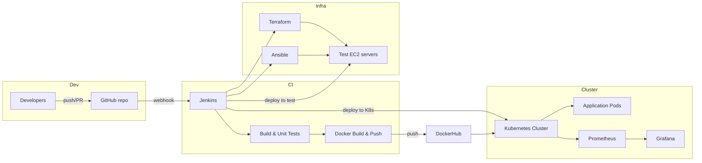

# healthcare-ci-cd-automation — Repo Guide & Architecture

> A complete repository guide with architecture diagrams and step‑by‑step instructions to reproduce the DevOps pipeline used in the HealthCare project (Jenkins + Terraform + Ansible + Docker + Kubernetes + Prometheus/Grafana).

---

## 1. Project Summary

This repository demonstrates an end‑to‑end DevOps pipeline for a healthcare application. The pipeline is triggered by GitHub commits, builds and tests the application, creates Docker images, provisions test infrastructure on AWS using Terraform, configures servers using Ansible, deploys to Kubernetes, and monitors the system with Prometheus and Grafana.

**Key technologies:** Jenkins, GitHub, Terraform, AWS (EC2), Ansible, Docker, DockerHub, Kubernetes, Prometheus, Grafana, Maven (Java/Spring Boot)

---

## 2. High‑level architecture



> *Mermaid diagram above shows the flow from code commit to monitoring.*

---

## 3. Repository layout (recommended)

```
healthcare-ci-cd-automation/
├── README.md
├── Jenkinsfile
├── terraform/
│   ├── main.tf
│   ├── variables.tf
│   └── outputs.tf
├── ansible/
│   ├── inventory.ini
│   └── test_server.yaml
├── docker/
│   └── Dockerfile
├── k8s/
│   ├── health_deployment.yaml
│   ├── health_service.yaml
│   └── prometheus-grafana-helm-values.yaml
├── scripts/
│   └── helper-scripts.sh
├── docs/
│   └── architecture.png
└── .github/ (optional: issue templates)
```

---

## 4. Step‑by‑step implementation guide

Below are the actionable steps (sequence + why) with example snippets you can copy into your repo.

### 4.1. Prepare GitHub repo

* Create a repo named `healthcare-ci-cd-automation` (public or private).
* Add a clear `README.md`, license, and `.gitignore`.
* Protect `master`/`main` branch if you use it in production, enable PR reviews.
* Create necessary GitHub webhooks or let Jenkins multibranch job poll Git.

---

### 4.2. Jenkins (CI server)

**What Jenkins does:** listens for pushes/PRs, runs the pipeline, stores credentials, reports tests, and triggers infra/provision/deploy stages.

**Jenkinsfile (declarative) — template**

```groovy
pipeline {
  agent any
  environment {
    REPO_URL = 'https://github.com/<you>/star-agile-health-care.git'
    DOCKER_CREDS = 'dockerhub-creds'
    DOCKER_IMAGE = 'yourdockerhubusername/healthcare-app'
    SSH_CREDENTIAL = 'jenkins-ssh-key'
    TF_DIR = 'terraform'
  }
  stages {
    stage('Checkout') { steps { git url: env.REPO_URL, branch: 'master' } }
    stage('Build & Test') {
      steps {
        sh 'mvn -B clean package'
        junit 'target/surefire-reports/*.xml'
      }
    }
    stage('Build Docker') {
      steps {
        script { dockerImage = docker.build("${DOCKER_IMAGE}:${env.BUILD_ID}") }
      }
    }
    stage('Push Docker') {
      steps {
        withCredentials([usernamePassword(credentialsId: env.DOCKER_CREDS, usernameVariable: 'DOCKER_USER', passwordVariable: 'DOCKER_PASS')]) {
          script {
            docker.withRegistry('https://index.docker.io/v1/', env.DOCKER_CREDS) { dockerImage.push('latest') }
          }
        }
      }
    }
    stage('Provision Test Server') {
      steps { dir(env.TF_DIR) { sh 'terraform init && terraform apply -auto-approve' } }
    }
    stage('Configure Test Server') { steps { sh "ansible-playbook -i ansible/inventory.ini ansible/test_server.yaml --private-key=~/.ssh/id_rsa" } }
    stage('Deploy to Test Server & Run Tests') { steps { sh "./scripts/deploy-and-test.sh ${DOCKER_IMAGE}:latest" } }
    stage('Deploy to K8s') { steps { sh 'kubectl apply -f k8s/health_deployment.yaml' } }
  }
  post { always { archiveArtifacts allowEmptyArchive: true, artifacts: 'target/*.jar' } }
}
```

**Notes:**

* Keep credentials (DockerHub, AWS keys, SSH keys) in Jenkins' **Credentials** store, never in code.
* Use `multibranch` Jenkins job or GitHub webhooks for automatic triggers.

---

### 4.3. Terraform (Provisioning)

**What Terraform does:** creates EC2 instances (test servers), security groups, key pairs. Use remote state (S3 + DynamoDB) for team workflows.

**Minimal `main.tf` snippet**

```hcl
provider "aws" { region = "ap-south-1" }
resource "aws_key_pair" "jenkins_key" { key_name = "jenkins-master-keypair" public_key = file("~/.ssh/id_rsa.pub") }
resource "aws_security_group" "allow_all" { name = "allow_all" ingress { from_port = 0 to_port = 0 protocol = "-1" cidr_blocks = ["0.0.0.0/0"] } }
resource "aws_instance" "test_server" { ami = "ami-<id>" instance_type = "t3.micro" key_name = aws_key_pair.jenkins_key.key_name vpc_security_group_ids = [aws_security_group.allow_all.id] tags = { Name = "test-server" } }
output "test_server_ip" { value = aws_instance.test_server.public_ip }
```

**Commands**

```bash
cd terraform
terraform init
terraform plan -out=tfplan
terraform apply -auto-approve
terraform output test_server_ip
```

**Best practices**

* Store sensitive AWS creds in Jenkins (or use IAM role on CI runner).
* Use `terraform fmt` and `terraform validate` in pipeline.
* Use S3 backend + state locking (DynamoDB) for collaboration.

---

### 4.4. Ansible (Configuration)

**What Ansible does:** prepares the test server: installs Docker, Java, Maven, configures user groups, and deploys the container.

**Sample `ansible/test_server.yaml`**

```yaml
- hosts: test_server
  become: true
  tasks:
    - name: update apt
      apt:
        update_cache: yes
    - name: install docker
      apt:
        name: docker.io
        state: present
    - name: start docker
      service:
        name: docker
        state: started
        enabled: yes
    - name: install openjdk
      apt:
        name: openjdk-17-jdk
        state: present
    - name: install maven
      apt:
        name: maven
        state: present
```

**Inventory (generated from Terraform output)**

```
[test_server]
<TEST_SERVER_IP> ansible_user=ubuntu ansible_ssh_private_key_file=~/.ssh/id_rsa
```

**Run from Jenkins:** Ansible stage should create `inventory.ini` from Terraform output and run `ansible-playbook` with the private key stored on the Jenkins agent.

---

### 4.5. Dockerizing the application

**Dockerfile (Spring Boot fat JAR example)**

```dockerfile
FROM eclipse-temurin:17-jdk-focal
ARG JAR_FILE=target/*.jar
COPY ${JAR_FILE} /app/app.jar
EXPOSE 8082
ENTRYPOINT ["java","-jar","/app/app.jar"]
```

**Build & push (local)**

```bash
mvn clean package -DskipTests
docker build -t yourdockerhubuser/healthcare-app:latest .
docker push yourdockerhubuser/healthcare-app:latest
```

**In pipeline:** use Jenkins Docker plugin or `docker` CLI with credentials bound from Jenkins.

---

### 4.6. Kubernetes manifests (Deployment + Service)

**`k8s/health_deployment.yaml`**

```yaml
apiVersion: apps/v1
kind: Deployment
metadata:
  name: medical-app
spec:
  replicas: 2
  selector:
    matchLabels:
      app: medical-app
  template:
    metadata:
      labels:
        app: medical-app
    spec:
      containers:
      - name: medical-app
        image: yourdockerhubuser/healthcare-app:latest
        ports:
        - containerPort: 8082
        readinessProbe:
          httpGet:
            path: /actuator/health
            port: 8082
          initialDelaySeconds: 10
          periodSeconds: 10
        livenessProbe:
          httpGet:
            path: /actuator/health
            port: 8082
          initialDelaySeconds: 20
          periodSeconds: 20
        resources:
          limits:
            cpu: "500m"
            memory: "512Mi"
      strategy:
        type: RollingUpdate
        rollingUpdate:
          maxUnavailable: 1
          maxSurge: 1
---
apiVersion: v1
kind: Service
metadata:
  name: medical-app-service
spec:
  type: NodePort
  selector:
    app: medical-app
  ports:
    - port: 80
      targetPort: 8082
      nodePort: 31441
```

**Deploy**

```bash
kubectl apply -f k8s/health_deployment.yaml
kubectl rollout status deployment/medical-app
kubectl get svc,po -o wide
```

**Zero‑downtime:** use readiness probes & rolling update strategy as above.

---

### 4.7. Automated tests (integration)

* Run `mvn test` on the Jenkins agent during Build stage.
* For system/integration tests that require the running app, run tests on the **test server** after the container is started (run via SSH from Jenkins). Example: `ssh ubuntu@<TEST_SERVER_IP> 'cd star-agile-health-care && ./mvnw verify -Dskip.unit=false'`.
* Publish JUnit reports in Jenkins with `junit 'target/surefire-reports/*.xml'`.

---

### 4.8. Monitoring — Prometheus & Grafana

**Install (example using Helm)**

```bash
helm repo add prometheus-community https://prometheus-community.github.io/helm-charts
helm repo add grafana https://grafana.github.io/helm-charts
helm repo update
helm install monitoring prometheus-community/kube-prometheus-stack --namespace monitoring --create-namespace
```

**Access Grafana**

```bash
kubectl get secret --namespace monitoring monitoring-grafana -o jsonpath="{.data.admin-password}" | base64 --decode
kubectl port-forward svc/monitoring-grafana 3000:80 -n monitoring
# then open http://localhost:3000
```

**What to monitor**

* Kubernetes node and pod health, CPU/memory usage
* Application endpoint (liveness/readiness) and response latency
* Docker image pull success/failures
* Jenkins job durations and success rates

**Suggested Grafana dashboards**

* Pod CPU/Memory
* Application latencies and error rates
* Alert rules for node down or pod crashloop

---

## 5. Security & operational best practices

* **No secrets in repo.** Use Jenkins credentials, AWS IAM roles, or Vault.
* **Least privilege IAM** for Terraform – create separate IAM user/role with minimal permissions for EC2 & SG management.
* **Remote Terraform state** (S3 + DynamoDB) to avoid state corruption.
* **Use tags** on AWS resources for billing & cleanup.
* **Cleanup** test infra in `post` block of Jenkinsfile (terraform destroy) to avoid costs.
* **Audit logs**: enable CloudTrail and Jenkins audit plugin if possible.
* **Image scanning**: integrate container image scanning (Trivy) in pipeline.

---

## 6. Example workflow (one commit -> prod)

1. Dev pushes to `feature/*` branch → PR opened. Jenkins runs tests on PR.
2. PR reviewed & merged to `master`. GitHub webhook triggers Jenkins.
3. Jenkins builds, runs unit tests, builds Docker image, pushes to DockerHub.
4. Terraform provisions a fresh test server (or reuses existing test cluster).
5. Ansible configures the test server; Jenkins deploys the image to test server.
6. Integration tests run against test endpoint. If successful, Jenkins applies Kubernetes manifests to prod cluster.
7. Prometheus scrapes metrics; Grafana displays dashboards and alerts.

---

## 7. Troubleshooting quick‑tips

* `ssh` failing: ensure security group allows 22 and keypair is correct.
* Terraform apply fails: run `terraform plan` and inspect error; check provider creds.
* Docker push fails: verify DockerHub creds in Jenkins and image tag.
* Kubernetes pods CrashLoop: `kubectl logs pod/<pod>` and `kubectl describe pod/<pod>` to inspect.
* Jenkins job hanging: check agent availability and disk space.

---

*End of guide.*
